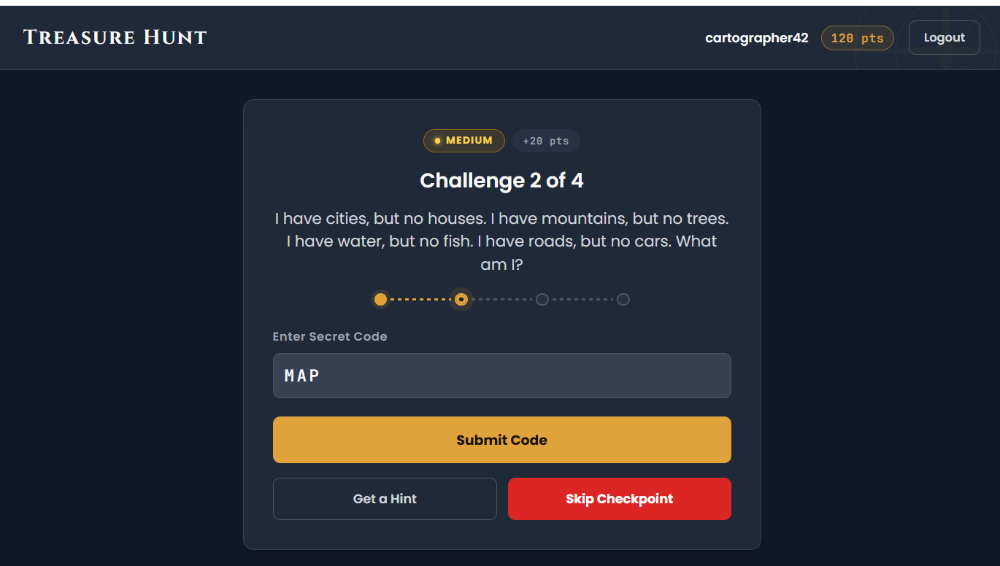

# 🏴‍☠️ Treasure Hunt — Redesigned

> A drop-in replacement for the original Treasure Hunt web application with a fresh, immersive pirate-themed design.



## ✨ What's New

Experience the treasure hunt like never before! Here's what makes this redesign special:

| Feature | Description |
|---------|-------------|
| **🌟 Doubloon Gold Accent** | Primary buttons, focus states, score display, and celebration screens now gleam with gold |
| **📜 Cinzel Display Font** | The "Treasure Hunt" wordmark and victory messages use elegant serif typography |
| **💻 JetBrains Mono** | Secret code inputs, leaderboard ranks, and scores use a sleek monospace font |
| **🧭 Compass Rose Decoration** | Subtle compass watermark in the auth screen background and header |
| **🎭 Backdrop Blur** | Modal overlays now have a smooth blur effect for focus |
| **📊 Score Pill** | Header displays score in a gold-tinted pill instead of plain text |
| **🏆 Enhanced Leaderboard** | Uppercase headers, hover effects, monospace rank/score, gold #1 highlight, green "Finished!" badges |

## 🚀 Quick Setup

Ready to bring the treasure home? Here's how:

### 1. Replace Files
Copy these files to your repo root:
- `index.html`
- `dashboard.html`
- `admin.html`
- `style.css`

### 2. Copy Assets
```bash
cp -r redesigned/assets/ ./assets/
```

### 3. Configure Supabase
The Supabase credentials are already pre-configured in all HTML files:
- **URL:** `https://sfvnssyrmikyyyewwdkw.supabase.co`
- **Key:** `eyJhbGciOiJIUzI1NiIsInR5cCI6IkpXVCJ9...`

> ⚠️ **Pro Tip:** If you're using your own Supabase instance, update the `SUPABASE_URL` and `SUPABASE_ANON_KEY` constants in each HTML file.

## 🎮 How It Works

### Player Flow
1. **Landing** → Login or create an account
2. **Dashboard** → Solve puzzles, submit secret codes, earn points
3. **Challenges** → Easy → Medium → Hard → Medium progression
4. **Finish** → See final score on the leaderboard

### Admin Flow
1. **Admin Dashboard** → View live leaderboard
2. **Monitor** → See all participants' progress in real-time
3. **Reset** → Clear a player's progress if needed

## 🛠️ Tech Stack

- **Frontend:** Vanilla HTML, CSS, JavaScript
- **Backend:** Supabase (Auth, Database, Realtime)
- **Fonts:** Cinzel, Poppins, JetBrains Mono

## 📂 Project Structure

```
├── index.html          # Login/Signup page
├── dashboard.html      # Player game interface
├── admin.html          # Admin leaderboard
├── style.css           # All styles (drop-in replacement)
├── assets/
│   ├── logo-mark.svg
│   └── compass-rose.svg
└── preview.html        # Quick preview of all pages
```

---

*All copy strings and functionality preserved from the original — only the design has been reimagined!* 🏴‍☠️